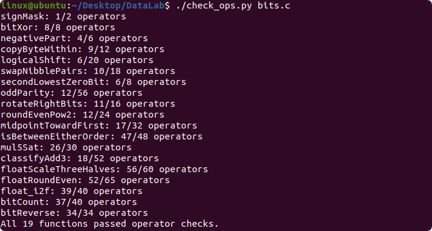
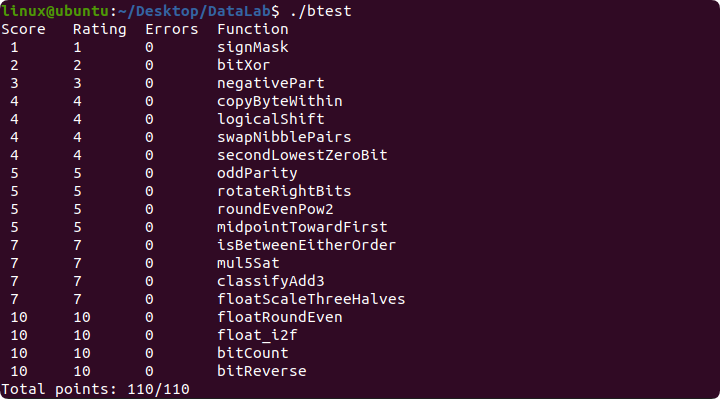

## DataLab 实验报告

> ——吴童 25803050055

### 实验成果

### 实验过程

#### 01

直接做即可。

#### 02

用 `x&~y` 和 `~x&y` cos `^`，再用 `~(~ &~ )` cos `|`。

#### 03

如果 `x<0`，那么 `x>>31` 为 -1，否则为 0。直接 `&-x` 即可。

#### 04

先 `<<=3`，由第几个字节得到第几位。

然后 `&~(255<<dst)` 清空目标 8 位，`|(x>>src&255)<<dst` 提取来源 8 位并移到目标 8 位上。

#### 05

右移 n 位。如果是负数，把高 n 位再去掉。

#### 06

令 `u=0x0f0f0f0f,v=0xf0f0f0f0`，然后就好做了。仍然要特殊处理最高的 4 位。

#### 07

先 `x|=x+1` 去掉最低的 0。然后取反用 `x&-x` 取 lowbit。

#### 08

把所有位异或到一起即可。

#### 09

类似 05。

#### 10

如果第 n-1 位为 `0`，那么变小，否则变大。

对于特殊情况，根据第 n 位进行判断。如果是 `0`，直接把整个数减一即可。

#### 11

这个题很麻烦。

基础思路是输出 `x+(y-x>>1)`。

但是 `y-x` 可能很大。把 `x` 和 `y` 的最低位剥离出来，手搓一个 33 位的整形进行运算。

另一个问题是 `>>1` 其实是下取整，而我们需要向零舍入。加一个修正值即可。

#### 12

和 11 类似，判断 `x-a` 和 `b-a` 是否同号，`x-b` 和 `a-b` 是否同号。

特殊处理数字相等的情况。

#### 13

和 11 类似，手搓一个 35 位的整形。

#### 14

和 13 类似，手搓一个 35 位的整形。

#### 15

对于每种情况讨论一下即可。

#### 16

需要讨论更多的情况。

#### 17

找一下最高位，然后处理一下。

#### 18

先把相邻两个加起来，然后四个加起来，然后八个加起来，最后全部加起来。

#### 19

交换奇数位和偶数位，然后把相邻两位看作整体继续做。

这个操作数限制太严厉了。

### AI 使用声明

个别题目参考了 AI 的实现。

### 感受与建议

感觉特别困难。大部分题都做很久才能做出来，一部分题做很久也做不出来。

int 自然溢出是 ub，做的时候偶尔会遇到意外。

建议多放人类能做的题。